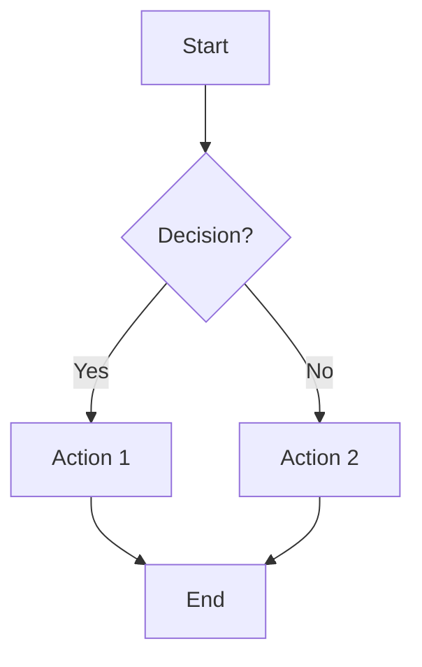
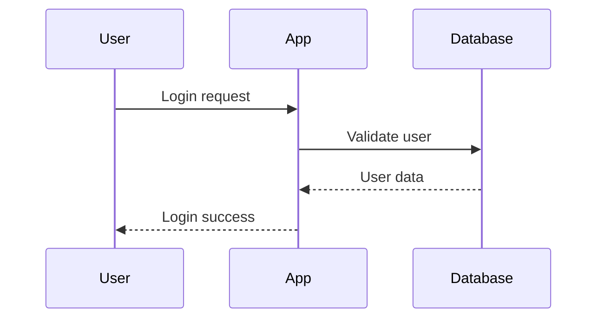
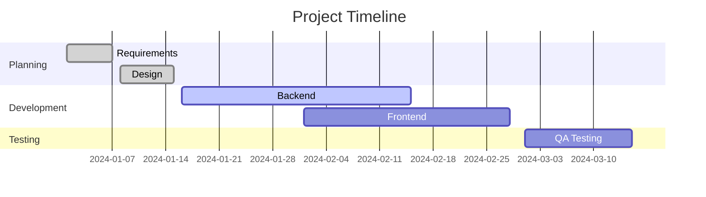

# Markdown Support Guide

mory provides comprehensive Markdown support with many advanced features and extensions. This guide covers all the formatting options available for creating rich, well-structured notes.

## Markdown Overview

### Why Markdown?

- **Future-proof** - Plain text files that will always be readable
- **Portable** - Works across all platforms and applications
- **Readable** - Human-readable even in raw form
- **Powerful** - Rich formatting without complex markup
- **Git-friendly** - Excellent version control support

### mory's Markdown Features

mory extends standard Markdown with:
- **Live Preview** - See formatted output as you type
- **Syntax Highlighting** - Code blocks with language-specific highlighting
- **Math Equations** - LaTeX-style math rendering with KaTeX
- **Diagrams** - Mermaid diagram support
- **Tables** - Enhanced table formatting and editing
- **Task Lists** - Interactive checkbox tasks
- **Definition Lists** - Pandoc-style definition lists
- **Custom HTML** - Embedded HTML elements

## Basic Formatting

### Headers

```markdown
# Header 1 (Page Title)
## Header 2 (Main Sections)
### Header 3 (Subsections)
#### Header 4 (Details)
##### Header 5 (Fine Details)
###### Header 6 (Smallest)
```

**Automatic Features**
- Headers generate clickable anchors
- Table of contents automatically created
- Navigation links added to headers
- Scroll synchronization in preview

### Text Formatting

```markdown
**Bold text** or __Bold text__
*Italic text* or _Italic text_
***Bold and italic*** or ___Bold and italic___
~~Strikethrough text~~
`Inline code`
```

**Advanced Text Formatting**
```markdown
Text with <mark>highlighted</mark> sections
Text with <sub>subscript</sub> and <sup>superscript</sup>
Text with <u>underline</u> (use sparingly)
```

### Paragraphs and Line Breaks

```markdown
This is a paragraph. It continues until there's a blank line.

This is a new paragraph.

For a line break without a new paragraph,  
end the line with two spaces.

Or use a backslash\
for a line break.
```

## Lists

### Unordered Lists

```markdown
- Item 1
- Item 2
  - Nested item 2.1
  - Nested item 2.2
    - Deeply nested item
- Item 3

* Alternative bullet style
* Works the same way
  * Nested items
  * Multiple levels

+ Another bullet style
+ Also supported
```

### Ordered Lists

```markdown
1. First item
2. Second item
   1. Nested numbered item
   2. Another nested item
3. Third item

# Alternative numbering
1) First item
2) Second item

# Auto-numbering (all 1s work)
1. First item
1. Second item (becomes 2)
1. Third item (becomes 3)
```

### Task Lists

```markdown
- [ ] Incomplete task
- [x] Completed task
- [-] Cancelled task
- [>] Deferred task
- [?] Question/unclear task

# Nested task lists
- [ ] Main project
  - [x] Research phase
  - [x] Planning phase
  - [ ] Development phase
    - [x] Setup environment
    - [ ] Implement features
    - [ ] Testing
  - [ ] Deployment phase
```

### Definition Lists

```markdown
Term 1
: Definition of term 1

Term 2
: Definition of term 2
: Second definition of term 2

Complex Term
: This is a longer definition that can span
  multiple lines and include **formatting**.
```

## Links and References

### Basic Links

```markdown
[Link text](https://example.com)
[Link with title](https://example.com "Hover title")
<https://example.com> (Automatic link)
```

### Internal Links

```markdown
[Other Note](other-note.md)
[Section in Current Note](#header-name)
[Section in Other Note](other-note.md#specific-section)
```

### Reference Links

```markdown
[Link text][reference-id]
[Another link][ref2]

[reference-id]: https://example.com "Optional title"
[ref2]: https://another-example.com
```

### Email Links

```markdown
<email@example.com>
[Send Email](mailto:email@example.com)
[Email with Subject](mailto:email@example.com?subject=Hello)
```

## Images

### Basic Images

```markdown


```

### Image with HTML Attributes

```markdown


```

### Reference Images

```markdown
![Alt text][image-ref]

[image-ref]: files/image.png "Image title"
```

### Image Galleries

```markdown
# Project Screenshots


```

## Code and Syntax Highlighting

### Inline Code

```markdown
Use the `console.log()` function for debugging.
File paths like `/home/user/documents` should be in code format.
Press `Ctrl+C` to copy.
```

### Code Blocks

**Basic Code Block**
```
```
function hello() {
    console.log("Hello, world!");
}
```
```

**With Syntax Highlighting**
```
```javascript
function calculateTotal(items) {
    return items.reduce((sum, item) => sum + item.price, 0);
}
```

```python
def fibonacci(n):
    if n <= 1:
        return n
    return fibonacci(n-1) + fibonacci(n-2)
```

```sql
SELECT users.name, COUNT(orders.id) as order_count
FROM users
LEFT JOIN orders ON users.id = orders.user_id
GROUP BY users.id;
```
```

### Supported Languages

mory supports syntax highlighting for:
- **Web**: HTML, CSS, JavaScript, TypeScript
- **Programming**: Python, Java, C++, C#, Go, Rust
- **Scripting**: Bash, PowerShell, Batch
- **Data**: JSON, YAML, XML, CSV
- **Markup**: Markdown, LaTeX
- **Configuration**: Dockerfile, Nginx, Apache
- **And many more...**

### Code Block Features

```
```javascript {.line-numbers}
// Line numbers shown
function example() {
    return "Hello";
}
```

```python {.highlight-lines="2,4"}
# Lines 2 and 4 will be highlighted
def example():
    important_line = "highlighted"
    normal_line = "not highlighted"
    another_important = "also highlighted"
```
```

## Tables

### Basic Tables

```markdown
| Header 1 | Header 2 | Header 3 |
|----------|----------|----------|
| Row 1    | Data     | More     |
| Row 2    | Info     | Data     |
```

### Table Alignment

```markdown
| Left Aligned | Center Aligned | Right Aligned |
|:-------------|:--------------:|--------------:|
| Left         | Center         | Right         |
| Data         | Data           | Data          |
```

### Complex Tables

```markdown
| Feature | Basic | Pro | Enterprise |
|---------|-------|-----|------------|
| Users | 1 | 10 | Unlimited |
| Storage | 1GB | 100GB | 1TB |
| Support | Email | **Priority** | 🏆 **Dedicated** |
| Price | Free | $10/mo | $50/mo |
```

### Table Formatting

mory provides a "Format Table" button to automatically:
- Align columns
- Add proper spacing
- Fix column separators
- Maintain table structure

## Math Equations

### Inline Math

```markdown
The equation $E = mc^2$ was developed by Einstein.
Use $\pi \approx 3.14159$ for calculations.
```

### Block Math

```markdown
$$
\int_{-\infty}^{\infty} e^{-x^2} dx = \sqrt{\pi}
$$

$$
\begin{align}
f(x) &= ax^2 + bx + c \\
f'(x) &= 2ax + b \\
f''(x) &= 2a
\end{align}
$$
```

### Mathematical Notation

```markdown
# Common math examples

$$
\sum_{i=1}^{n} x_i = x_1 + x_2 + \cdots + x_n
$$

$$
\frac{d}{dx}\left( \int_{0}^{x} f(u)\,du\right) = f(x)
$$

$$
\begin{pmatrix}
a & b \\
c & d
\end{pmatrix}
\begin{pmatrix}
x \\
y
\end{pmatrix} =
\begin{pmatrix}
ax + by \\
cx + dy
\end{pmatrix}
$$
```

## Diagrams with Mermaid

### Flowcharts

```

```

### Sequence Diagrams

```

```

### Gantt Charts

```

```

### Other Diagram Types

```
```mermaid
# Pie Chart
pie title Project Time Distribution
    "Development" : 45
    "Testing" : 25
    "Planning" : 20
    "Documentation" : 10

# Class Diagram
classDiagram
    class User {
        +String name
        +String email
        +login()
        +logout()
    }
    class Admin {
        +manageUsers()
    }
    User <|-- Admin
```
```

## Quotes and Citations

### Blockquotes

```markdown
> This is a blockquote.
> It can span multiple lines.

> Nested quotes work too.
>> This is a nested quote.
>> Even deeper nesting is possible.

> **Note**: Blockquotes can contain formatting.
> 
> - Lists
> - `Code`
> - [Links](example.com)
```

### Citations

```markdown
According to the documentation[^1], this feature works as expected.

The research shows promising results[^2].

[^1]: Official mory documentation, 2024
[^2]: Smith, J. (2024). "Advanced Note-Taking Systems"
```

## HTML Integration

### Basic HTML Elements

```markdown
<div class="highlight">
This content has custom styling.
</div>

<span style="color: red;">Red text</span>

<details>
<summary>Click to expand</summary>
Hidden content goes here.
</details>
```

### HTML in Markdown

```markdown
# Mixed Content

Regular **markdown** formatting works alongside <em>HTML</em>.

<div class="two-column">

## Column 1
- Item 1
- Item 2

## Column 2  
- Item A
- Item B

</div>
```

### Custom Components

```markdown
<div class="callout info">
📘 **Info**: This is an information callout box.
</div>

<div class="callout warning">
⚠️ **Warning**: Be careful with this operation.
</div>

<div class="callout success">
✅ **Success**: Operation completed successfully.
</div>
```

## Advanced Features

### Frontmatter (YAML)

```yaml
---
title: "Document Title"
author: "Your Name"
date: "2024-01-15"
tags: ["tag1", "tag2"]
status: "draft"
events:
  meeting:
    start: "2024-01-15 14:00"
    end: "2024-01-15 15:00"
---

# Document Content

Content goes here...
```

### Custom CSS Classes

```markdown
<div class="custom-layout">

# Special Layout

This content uses custom CSS classes.

</div>

Text with custom{.highlight} styling.
```

### Comments

```markdown
<!-- This is a comment that won't appear in the rendered output -->

Content here...

<!-- 
Multi-line comments
can span multiple lines
and are useful for notes to yourself
-->
```

## Keyboard Shortcuts

### Editor Shortcuts

- `Ctrl/Cmd + B` - Bold selection
- `Ctrl/Cmd + I` - Italic selection  
- `Ctrl/Cmd + K` - Insert link
- `Ctrl/Cmd + Shift + K` - Insert image
- `Tab` - Indent (in lists)
- `Shift + Tab` - Unindent
- `Ctrl/Cmd + /` - Toggle comment

### Formatting Shortcuts

- `**text**` → **text** (Bold)
- `*text*` → *text* (Italic)
- `~~text~~` → ~~text~~ (Strikethrough)
- `` `text` `` → `text` (Code)
- `[text](url)` → [text](url) (Link)

## Best Practices

### Document Structure

1. **Use Headers Hierarchically** - Don't skip header levels
2. **One H1 per Document** - Use H1 for the main title
3. **Consistent Formatting** - Stick to chosen conventions
4. **Meaningful Links** - Use descriptive link text

### Content Organization

1. **Start with Overview** - Brief introduction or summary
2. **Logical Flow** - Organize content in logical order
3. **Use Lists Effectively** - Break up dense text
4. **Add Table of Contents** - For longer documents

### Collaborative Guidelines

1. **Consistent Style** - Agree on formatting conventions
2. **Clear References** - Use full paths for links
3. **Document Changes** - Use Git commit messages effectively
4. **Regular Reviews** - Check and update content regularly

## Troubleshooting

### Common Formatting Issues

**Headers Not Rendering**
```markdown
# Correct - space after #
#Incorrect - no space
```

**Links Not Working**
```markdown
[Correct](file.md)
[Incorrect] (file.md)  # Extra space
```

**Code Blocks Not Highlighting**
```
```javascript
// Correct - language specified
```

```
// Incorrect - no language
```
```

**Tables Not Formatting**
```markdown
| Correct | Table |
|---------|--------|
| Data    | Here   |

|Incorrect|Table|
|No spaces around pipes|
```

### Preview Issues

**Math Not Rendering**
- Check for proper `$` or `$$` delimiters
- Verify LaTeX syntax is correct
- Ensure no conflicting characters

**Diagrams Not Showing**
- Verify mermaid syntax
- Check for proper code block formatting
- Ensure diagram type is supported

**Images Not Loading**
- Check file path is correct
- Verify image exists in repository
- Ensure proper file permissions

## Getting Help

For additional Markdown support:
- Review [Notes guide](notes.md) for note-specific features
- Check [Configuration](configuration.md) for markdown settings
- See examples in the [Quick Start guide](quick-start.md)
- Report markdown issues on [GitHub](https://github.com/yuttie/mory/issues)