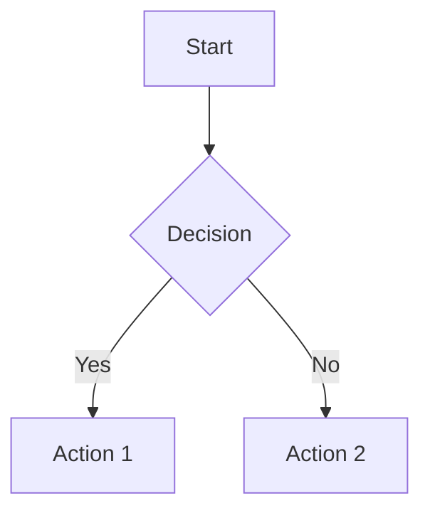

# Notes Guide

mory's note-taking system is built around Markdown and provides a powerful, flexible environment for capturing and organizing your thoughts.

## Note Basics

### Creating Notes

**New Note**
1. Click the **"+"** button or navigate to **Create**
2. Choose a filename (e.g., `my-note.md`)
3. Optionally select a template
4. Start writing

**From Template**
- Templates help maintain consistency
- Create custom templates for different note types
- Common templates: meeting notes, daily journal, project planning

### Note Structure

Every note in mory is a Markdown file with optional frontmatter:

```markdown
---
tags: ["work", "important"]
created: "2024-01-15"
events:
  meeting:
    start: "2024-01-15 14:00"
    end: "2024-01-15 15:00"
---

# Note Title

Your content goes here...
```

## The Editor Interface

### Layout Modes

mory offers flexible viewing options:

- **Editor Only** - Pure writing mode
- **Preview Only** - Formatted view
- **Split View** - Edit and preview side by side
- **Mobile View** - Vertical layout for small screens

### Editor Features

**Syntax Highlighting**
- Multiple themes available (atom-one-dark, github, etc.)
- Real-time syntax highlighting for code blocks
- Language-specific highlighting

**Smart Editing**
- Auto-completion for Markdown syntax
- Bracket matching and auto-closing
- Line numbers (optional)
- Word wrap toggle
- Vim/Emacs keybindings available

**Live Preview**
- Instant rendering as you type
- Synchronized scrolling between editor and preview
- Table of contents with navigation
- Clickable links and references

## Markdown Features

mory supports enhanced Markdown with many extensions:

### Basic Formatting

```markdown
# Headers (H1 through H6)
## Subheader

**Bold text** and *italic text*
~~Strikethrough text~~

`Inline code` and code blocks:

```python
def hello_world():
    print("Hello from mory!")
```

### Lists and Tasks

```markdown
- Bullet lists
  - Nested items
  - Multiple levels

1. Numbered lists
2. Auto-numbering
3. Mixed with bullets

- [ ] Task lists
- [x] Completed tasks
- [ ] Pending items
```

### Links and References

```markdown
[External link](https://example.com)
[Internal note link](other-note.md)
[Link with title](https://example.com "Hover title")


```

### Tables

```markdown
| Column 1 | Column 2 | Column 3 |
|----------|----------|----------|
| Data     | More     | Data     |
| Row 2    | Info     | Here     |
```

**Table Formatting**
- Use the "Format Table" button to auto-align columns
- Supports column alignment (left, center, right)
- Sortable in preview mode

### Advanced Features

**Math Equations**
```markdown
Inline math: $E = mc^2$

Block math:
$$
\int_{-\infty}^{\infty} e^{-x^2} dx = \sqrt{\pi}
$$
```

**Mermaid Diagrams**
```markdown


**Definition Lists**
```markdown
Term 1
: Definition of term 1

Term 2
: Definition of term 2
: Can have multiple definitions
```

**Custom HTML**
```markdown
<div class="custom-class">
Custom styled content
</div>
```

## File Management

### Organizing Notes

**Folder Structure**
- Use `/` in filenames to create virtual folders
- Example: `projects/website/notes.md`
- Browse with the file manager

**Naming Conventions**
```
# Date-based
2024-01-15-daily-notes.md
2024-01-15-meeting-project-x.md

# Topic-based
projects/website/requirements.md
personal/reading-list.md
work/team-updates.md

# Hybrid
2024-01/project-planning.md
research/2024-ai-trends.md
```

### File Attachments

**Adding Files**
1. Use the **Files** tab to upload
2. Reference in notes: ``
3. Download links: `[Document](files/document.pdf)`

**Supported Types**
- Images: PNG, JPG, GIF, SVG
- Documents: PDF, DOC, TXT
- Code: Any text-based file
- Archives: ZIP, TAR (viewable but not executable)

## Note Metadata

### Frontmatter

YAML frontmatter adds structure and functionality:

```yaml
---
title: "Custom Title"
tags: ["work", "project", "urgent"]
created: "2024-01-15"
modified: "2024-01-16"
author: "Your Name"
status: "draft"
---
```

### Tags and Organization

**Using Tags**
- Categorize notes by topic, project, or priority
- Search by tags: `tag:work`
- Multiple tags per note
- Hierarchical tags: `work/project/urgent`

**Custom Metadata**
```yaml
---
project: "Website Redesign"
priority: "high"
deadline: "2024-02-01"
reviewers: ["alice", "bob"]
---
```

## Advanced Features

### Templates

**Creating Templates**
1. Create a note with your desired structure
2. Save in `templates/` folder
3. Use when creating new notes

**Example Template**
```markdown
---
tags: ["meeting"]
date: "{{ date }}"
attendees: []
---

# Meeting: {{ title }}

## Agenda
- 

## Discussion Notes


## Action Items
- [ ] 

## Next Steps

```

### Searching Notes

**Search Capabilities**
- Full-text search across all notes
- Search in titles, content, and metadata
- Filter by tags, dates, file types
- Regex support for advanced patterns

**Search Examples**
```
project website          # Find notes containing both words
"exact phrase"           # Exact phrase search
tag:work                 # Notes tagged with "work"
created:2024-01          # Notes created in January 2024
type:markdown            # Only markdown files
```

### Version Control

**Git Integration**
- Every change is automatically tracked
- View edit history for any note
- Restore previous versions
- Branching for experimental changes

**Best Practices**
- Write descriptive commit messages
- Regular backups to remote repositories
- Use branches for major reorganizations
- Tag important milestones

## Customization

### Editor Themes

Available themes include:
- Light themes: github, default, ascetic
- Dark themes: atom-one-dark, monokai, vs-dark
- High contrast: base16 variants
- Vintage: terminal, retro

### Custom Styling

**CSS Customization**
- Add custom CSS for note rendering
- Modify editor appearance
- Create custom color schemes
- Responsive design adjustments

**LESS Support**
- Write styles in LESS syntax
- Variables and mixins available
- Compiled automatically
- Import external stylesheets

## Keyboard Shortcuts

### Navigation
- `Ctrl/Cmd + N` - New note
- `Ctrl/Cmd + O` - Open note
- `Ctrl/Cmd + S` - Save (auto-save enabled)
- `Ctrl/Cmd + F` - Find in note
- `Ctrl/Cmd + G` - Go to line

### Editing
- `Ctrl/Cmd + B` - Bold selection
- `Ctrl/Cmd + I` - Italic selection
- `Ctrl/Cmd + K` - Insert link
- `Ctrl/Cmd + Shift + K` - Insert image
- `Tab` - Indent list item
- `Shift + Tab` - Unindent list item

### View Modes
- `Ctrl/Cmd + E` - Toggle editor
- `Ctrl/Cmd + P` - Toggle preview
- `Ctrl/Cmd + \` - Split view
- `Shift + Enter` - Toggle viewer

## Tips and Best Practices

### Writing Efficiently

1. **Use Templates** - Create templates for recurring note types
2. **Learn Shortcuts** - Master keyboard shortcuts for speed
3. **Auto-complete** - Let the editor help with Markdown syntax
4. **Preview Mode** - Regular preview checks ensure proper formatting

### Organization Strategies

1. **Consistent Naming** - Develop and stick to naming conventions
2. **Tag Strategy** - Use tags for cross-cutting concerns
3. **Date Prefixes** - Include dates for chronological organization
4. **Folder Structure** - Mirror your mental organization model

### Content Strategies

1. **Link Liberally** - Connect related notes with links
2. **Use Headers** - Structure content with clear headings
3. **Task Integration** - Embed tasks directly in relevant notes
4. **Regular Reviews** - Schedule time to review and update notes

## Troubleshooting

### Common Issues

**Note Won't Save**
- Check file permissions
- Verify disk space
- Ensure valid filename

**Preview Not Updating**
- Refresh the browser
- Check for JavaScript errors
- Verify markdown syntax

**Images Not Displaying**
- Check file path is correct
- Ensure image is uploaded to `files/`
- Verify image format is supported

**Slow Performance**
- Large files may impact performance
- Consider splitting very long notes
- Optimize images before uploading

### Getting Help

For additional assistance:
- Check [Configuration](configuration.md) for settings
- Review [Markdown guide](markdown.md) for formatting help
- Report bugs on [GitHub Issues](https://github.com/yuttie/mory/issues)